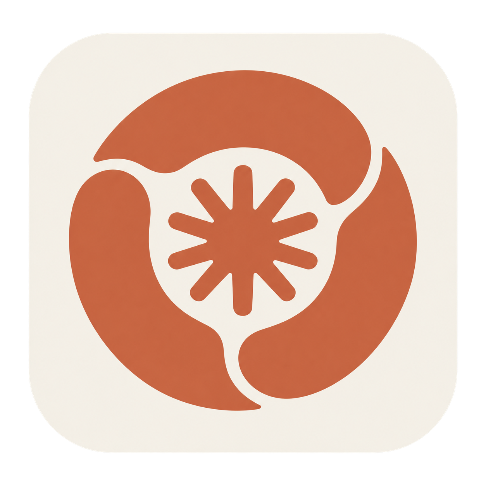

# Claude Chrome



[繁體中文](README.zh-Hant.md)

Claude Chrome 1.2.2 is a macOS browser app with a bundled Chrome engine, dedicated profile, and fixed local HTTP proxy. It uses its own name and Dock icon. The project is available at [miku233333/claude-chrome](https://github.com/miku233333/claude-chrome) under the MIT License.

## Requirements

- Apple silicon Mac running macOS 13 or later
- Google Chrome installed in `/Applications` when building
- An HTTP proxy listening on `127.0.0.1:17897`
- Command Line Tools with `swiftc`

## Build

Build from source:

```sh
./scripts/build.sh
```

The default build uses ad hoc signing. To use a stable local signing identity:

```sh
CLAUDE_CHROME_SIGNING_IDENTITY="YOUR_CODESIGN_IDENTITY" ./scripts/build.sh
```

The environment variable takes precedence; to keep the choice across shells, store the certificate's 40-character SHA fingerprint in `~/Library/Application Support/Claude Chrome/signing-identity.txt` with mode `0600`.

A stable identity can preserve the Keychain authorization identity across rebuilds. After changing identities, choose **Always Allow** on the first Keychain prompt. With the default ad hoc signature, a changed Chrome core hash may trigger the prompt again.

The app is written to `dist/Claude Chrome.app`. The build includes the locally installed Chrome engine. On APFS it clones the engine to share file data. It retains at most one previous build as `dist/Claude Chrome.app.latest-backup`.

The bundled engine is a snapshot of the installed Chrome version. To update it, update Google Chrome, rebuild Claude Chrome, and replace the app.

This repository distributes source and build instructions. It does not publish an unnotarized binary release. Install the locally built app by moving it to `/Applications`.

## Install

Copy `dist/Claude Chrome.app` into `/Applications`, then open it.

## Launch behavior

Claude Chrome opens the bundled environment-check page in its own browser window with an address bar and tabs. Use `⌘L` to enter a URL, `⌘N` for a new window, and `⌘T` for a new tab. The launch guard runs in the background; the browser provides the single Claude Chrome Dock icon. Opening that icon after quitting starts the launch guard again.

The dedicated profile disables Google browser sign-in, sync, and the AI Mode address-bar button. Chrome's native new-window and new-tab commands use the selected search engine's new-tab page; the checks govern the start page's Continue button, while the address bar supports direct navigation. Choose Google or DuckDuckGo in Chrome Settings → Search engine; the launcher preserves your search engine choice.

The dedicated profile is stored at `~/Library/Application Support/Claude Chrome/Profile`. A legacy profile at `~/.local/share/claude-network-guard/chrome-login-profile` is reused when present. Profile directories must be real directories with mode `0700`.

The launcher treats this as an offline browser profile: it disables Chrome's Google sign-in preference and starts Chrome with `--disable-sync`. Signing in to the Claude website is separate and remains available after the checks pass. Chrome runs with:

- `--proxy-server=http://127.0.0.1:17897`;
- `--webrtc-ip-handling-policy=disable_non_proxied_udp`;
- `--lang=<exit primary locale>`, with the profile's selected and accepted languages set from the exit country;
- `--new-window <local environment-check page>`.

The launcher uses `curl -q` with the explicit loopback proxy and an empty `--noproxy` value, so proxy bypass settings are not inherited. It obtains the exit IP, country, and IANA timezone from ipwho.is, then starts the dedicated Chrome process with `TZ=<IANA timezone>`. This changes neither the macOS timezone nor other Chrome profiles.

The launch guard retains the browser process, timezone, and language it started. New launch requests can reuse that browser after verifying its parent guard's running signature, the protected flags, timezone, and profile languages. Quitting the browser also ends the background guard. If the guard exits unexpectedly, the remaining browser process is unmanaged: fully quit that window before reopening Claude Chrome.

The launcher derives a primary locale from the exit country using macOS Foundation and ICU likely-subtags. Examples are Japan `ja-JP`, `ja`; United States `en-US`, `en`; Taiwan `zh-Hant-TW`, `zh-Hant`; and Singapore `en-SG`, `en`. Multi-language countries use the system locale data's default primary language. A country or language change requires a cold launch.

## Environment check

The local start page must pass every required check before its Continue button opens `https://claude.ai`. Clicking Continue repeats exit and reputation checks; a changed exit, snapshot, or risk clears any prior acknowledgement.

The Claude Code browser entry point can pass `--login-url <official OAuth URL>`. The link first opens the environment-check page; after passing, click Continue Claude Code sign-in to open the original official link. Failed checks keep continuation blocked. The launcher does not save the link in its settings, and the check page removes it from its current address.

- **Exit and region:** fresh Cloudflare Trace and ipwho.is responses must agree on public IP and country and match the native launch assessment. `Resources/SupportedRegions.js` contains the 185 Claude.ai countries from [Anthropic's supported-countries page](https://www.anthropic.com/supported-countries), captured on `2026-09-29`. Ukraine is excluded when its reported subdivision is Crimea, Donetsk, Kherson, Luhansk, or Zaporizhzhia; a missing Ukraine subdivision is unknown.
- **Timezone and clock:** the exit timezone and UTC offset must agree with live `Intl` and `Date` readings from both the main page and a Blob Worker.
- **IP reputation:** the native assessment calls ProxyCheck v3 without an API key and requires all seven risk booleans: `hosting`, `proxy`, `vpn`, `tor`, `compromised`, `scraper`, and `anonymous`. Any positive flag or risk score above 25 fails by default. A complete, fresh snapshot matching the exit can offer an unchecked, page-only acknowledgement when `hosting` alone is true and every other flag is explicitly false. Accepting the hosting IP and risk score never bypasses region, exit consistency, WebRTC, timezone, language, or browser-baseline checks. Unknown data and any other positive flag cannot be acknowledged; a changed snapshot or risk clears prior acknowledgement. Valid results are stored in a private per-profile cache for up to 30 minutes for the same exit IP; changes and expiry trigger a refresh. The anonymous service limit is [100 queries per day](https://proxycheck.io/api/).
- **WebRTC:** a Cloudflare STUN observation must complete without a private address, non-proxied UDP address, or public address different from the HTTPS exit.
- **Language and browser baseline:** the native exit language and ordered language list must match the fresh exit country and `navigator.language`/`navigator.languages`. It also checks `navigator.webdriver`, macOS Chrome user agent and platform, screen and processor values, repeatable local Canvas output, and WebGL renderer availability.

This is a conservative app gate created by this project. It is not an official Anthropic rule, individual-IP allowlist, account-eligibility decision, or anti-ban guarantee. If an upstream response is unavailable, malformed, inconsistent, expired, or rate-limited, the result is unknown and continuation stays locked.

### Privacy

Cloudflare Trace, ipwho.is, and ProxyCheck receive the outgoing IP needed for their checks; Cloudflare's STUN service can observe the WebRTC request. Browser fingerprint values and the Canvas digest are evaluated locally and are not sent by this app. The native assessment snapshot is placed in the local `file:` URL fragment, so it can remain in this profile's local browser history, and is also stored in the private profile cache.

### Local proxy configuration

The default proxy is `http://127.0.0.1:17897`. To use another local HTTP proxy, create `~/Library/Application Support/Claude Chrome/config.json` and restart the app:

```json
{
  "proxyURL": "http://127.0.0.1:7897"
}
```

`config.json` accepts only `proxyURL`. It must be an `http` or `https` URL with `localhost`, `127.0.0.1`, or `::1` and an explicit port. Credentials, URL paths, PAC URLs, and direct-bypass settings are not supported; no API key is required.

## Security scope

Claude Chrome is a Chrome privacy helper, not an operating-system network kill switch. It does not change macOS network settings and applies only to Chrome started by this launcher. The local proxy must already be running.

Claude Chrome is an independent project and is not affiliated with, endorsed by, or supported by Anthropic or Google.

Released under the MIT License.
